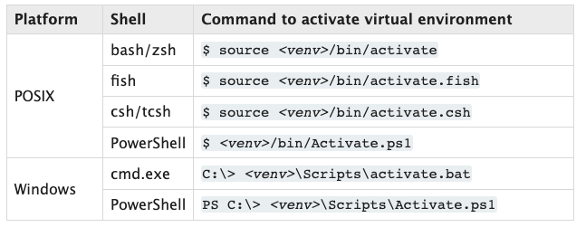

# Aula 1

## Ambientes virtuais no Python

A fim de isolar o ambiente de desenvolvimento com o Python existem os ambientes virtuais.
Dessa forma, podemos manter de maneira independente cada ambiente para cada projeto, evitando
conflitos de versão entre as bibliotecas e a propria linguagem.

### Nativamente, no python temos: VENV

#### Como criar?

`python -m venv <nome-do-ambiente>`

Observação:
> -m mod : run library module as a script (terminates option list)

- Exemplo: `python -m venv venv`

#### Como ativar?



### E quando eu preciso de mais de uma versão do Python? Pyenv ao resgate!

Nesse caso, podemos utilizar a ferramenta `pyenv`

#### Como?
Dentro desses links temos o passo-a-passo da instalação:

- Windows: https://github.com/pyenv-win/pyenv-win
- Linux/Mac: https://github.com/pyenv/pyenv

#### Baixando a versão desejada

`pyenv install <numero-da-versao>`

Exemplo:
- `pyenv install 3.11`

Observação:
> Pode ser que a versão desejada não está disponível. Você poderá procurar mais atualizando o seu pyenv.
> Se ele já estiver atualizado, realmente a versão não está disponível ainda (ou não existe)

#### Criando meu ambiente virtual com o Pyenv

`pyenv virtualenv <numero-da-versao> <nome-do-ambiente-virtual>`

Exemplo:
- `pyenv virtualenv 3.11 projeto-x`


#### Como ativar o ambiente?

`pyenv activate <nome-do-ambiente-virtual>`

Exemplo:
- `pyenv activate projeto-x`


## Gerenciadores de Dependência

São as ferramentas utilizadas para lidar com o ciclo de vida de um projeto. Porém, principalmente com relação a
gestão de dependências do projeto.

### Pip

Ferramenta nativa do Python para lidar com o gerenciamento de dependências do projeto.
Com ele podemos instalar bibliotecas e frameworks do Pypi ou alguma outra fonte externa de projetos python

#### Arquivo requirements.txt

Normalmente, com projetos Python classicos, documentamos todas as nossas dependencias num arquivo `.txt`.
Esse arquivo foi convencionado a chamar-se de `requirements`.

- Como fazer?
Criando um arquivo `.txt` com a lista das bibliotecas usadas

```txt
biblioteca1
biblioteca2
biblioteca3
...
```

- Exemplo:

```txt
flask
black
flake8
```

Observação:
> Para definir uma versão específica, basta você explicitar dessa forma: "biblioteca==1.0.0"

### PDM e Poetry

Alternativa mais moderna ao PIP e com mais funcionalidades, principalmente:

- Uso do `pyproject.toml` que é o manifesto do projeto. Onde guardamos os metadados da nossa aplicação. Semelhante ao `package.json` do NodeJS
- Melhor gestão das dependências

#### Porquê?

- Se atualizar mais rapidamente com as novas funcionalidades da comunidade (Novas PEPs)
- Usar metadados no projet
- Precisar de uma melhor resolução de conflito
  - Mais rápida
  - Mais eficiente e funcional (capacidade de ignorar conflitos, por exemplo)

## Sintaxe básica do Python
